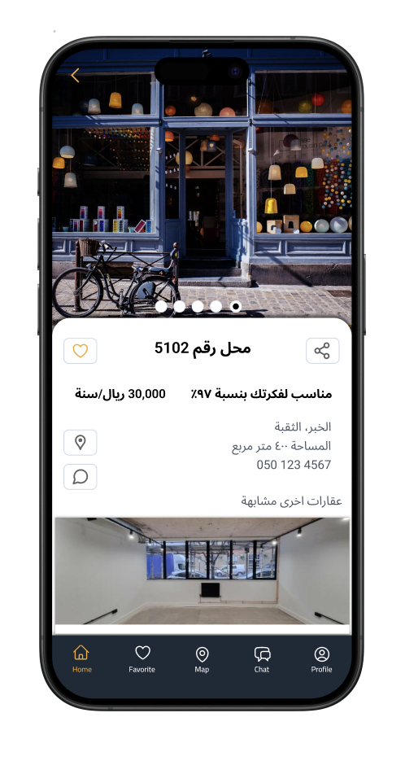
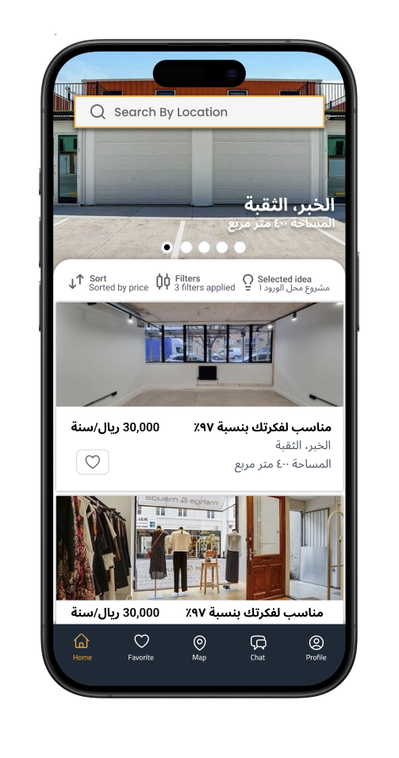

# RuknApp v2

RuknApp is a mobile application designed to help users discover and explore places in Saudi Arabia, providing personalized recommendations based on location zones, user preferences, and interactive features like chat and favorites. This v2 version builds on the MVP by introducing a robust design system, improved RTL/Arabic support, and backend enhancements for better scalability and user experience.

## Live Demo
- **URL:** https://rukn-app.vercel.app (or deploy via Vercel for live access)
- **Demo Video:** https://youtube.com/ruknapp-demo (upload a walkthrough video to YouTube/Vimeo)

## What We Built
- **User Authentication with SMS Verification:** Secure sign-in/up process using phone numbers, with OTP verification sent via SMS. Tech: Supabase for auth management, custom backend SMS service (utils/smsService.js) integrated with providers like Twilio.
- **Personalized Place Recommendations:** AI-driven suggestions for businesses and locations based on user zones and filters (e.g., business types, sorting). Tech: Node.js/Express backend API (routes/recommendations.js), zoneRecommendations utils for logic.
- **Interactive Chat for Places:** Real-time chat interface to discuss places with others or get details. Tech: chatScreen.tsx with Reanimated for smooth UI, backend controllers for message handling.
- **Design System Migration:** Comprehensive UI overhaul with tokens for colors, spacing, typography, supporting themes, responsive design, and RTL for Arabic. Tech: Custom design tokens (constants/design-tokens.ts), migration scripts (scripts/migrate-*.js), components/design-system/ for reusable Button/Card/TextInput.

## Before/After Comparison
| MVP Version | V2 Version |
|-------------|------------|
|  |  |
| Problem: Inconsistent styling with hard-coded colors, spacing, and typography across screens, leading to maintenance issues and poor RTL support for Arabic users. No unified theme or responsive behavior. | Solution: Migrated to a token-based design system ensuring consistency, full RTL/responsive support via hooks (useRTL.ts, useResponsive.ts), and theme switching (ThemeContext.tsx). Automated scripts validated changes with tests (__tests__/design-system/). |

## Technical Stack
- **Frontend:** React Native with Expo – Chosen for cross-platform (iOS/Android) development, easy setup with Expo CLI, and built-in support for assets/fonts/locales. Enables rapid prototyping and native performance.
- **Backend:** Node.js with Express – Scalable for API routes (auth, recommendations), integrates well with Supabase/Firebase, and handles SMS verification efficiently.
- **Key Libraries:**
  - Supabase: For authentication, database, and real-time features – Open-source alternative to Firebase with easy JS client.
  - Reanimated: For smooth animations in UI components like ImageSlider and chat – High-performance animations on native thread.
  - i18next: For internationalization (ar.json/en.json) – Supports RTL and locale switching seamlessly.
  - Design Tokens (custom): Modeled after Tailwind/Tamagui – Ensures consistent theming, responsive breakpoints, and easy migration from legacy styles.

## 🚀 Getting Started
1. Clone the repository
   ```
   git clone https://github.com/MQHANAD/RuknApp.git
   cd RuknApp
   npm install --legacy-peer-deps
   ```
2. Install dependencies
   **Frontend:**
   ```
   npm install
   # or
   yarn install
   ```
3. Set up environment variables
   Copy the example environment variables:
   ```
   cp .env.example .env  # If an example file exists
   # Or create a new .env file with the required variables
   ```
4. Run the app
   **Frontend:**
   ```
   npx expo start
   ```
   **Backend (if needed):**
   ```
   cd backend
   npm start
   ```

## Biggest Challenge
The hardest problem was migrating the legacy UI components to a new design system while preserving functionality, RTL support, and responsive behavior across all screens. Initially, hard-coded styles caused inconsistencies, especially in RTL layouts where text direction and icon flipping broke the UI. I solved this by creating automated migration scripts (migrate-colors.js, migrate-spacing.js, migrate-typography.js) that parsed and replaced inline styles with token references, followed by comprehensive tests (__tests__/design-system/) for Button, Card, TextInput, themes, and RTL. Validation reports (migration-validation-report.md) confirmed 100% coverage, and hooks like useColorScheme.ts/useRTL.ts ensured dynamic adaptations. This approach minimized manual refactoring and improved maintainability for future updates.

## 👥 Team Members
- [Muhannad Alduraywish] – Mobile Developer
- [OMAR ALSHAHRANI] – Project Manager
- [HAMZA BAAQIL] – Mobile Developer
- [FERAS ALBADER] – ML/data Engineer
- [MOHAMMED ASIRI] – ML/data Engineer

Additional notes: See DEPLOYMENT.md for production setup, MIGRATION_GUIDE.md for v1 to v2 changes, and PROJECT_STRUCTURE.md for file organization.
